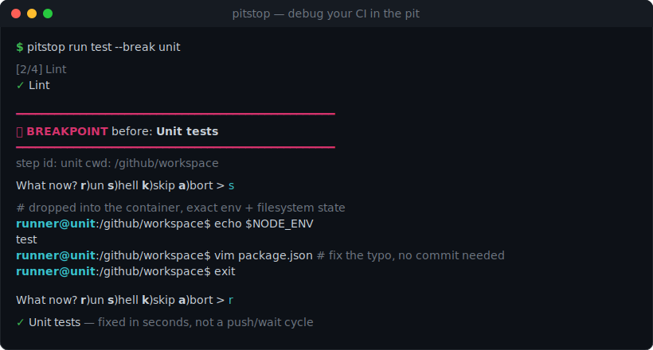

<div align="center">


# Pitstop

**Debug your CI in the pit, not on the track.**

**Breakpoints · Interactive shell · Real env & secrets · GitHub Actions · Docker · Zero commit-and-pray**

<!-- badges -->
[](https://github.com/TheJoeKD20/pitstop/actions/workflows/ci.yml)
[](#-quick-start)
[](LICENSE)
[](#-requirements)
[](https://github.com/TheJoeKD20/pitstop/actions/workflows/ci.yml)

<!-- nav chips -->
🏁 **[Quick start](#-quick-start)** · 📖 **[How it works](#-how-it-works)** · 🎯 **[Why Pitstop](#-why-pitstop)** · 🆚 **[vs act](COMPETITIVE.md)** · 🗺️ **[Roadmap](#%EF%B8%8F-roadmap)**

<br/>



<sub>Set a breakpoint → drop into the runner's shell with the exact env, secrets and filesystem → fix it → resume. **No account, no commit, ~30 seconds to your first breakpoint.**</sub>

</div>

---

<details>
<summary><strong>📑 Contents</strong></summary>

- [🛑 The problem](#-the-problem)
- [🎯 Why Pitstop](#-why-pitstop)
- [🚀 Quick start](#-quick-start)
- [📖 How it works](#-how-it-works)
- [✨ Commands](#-commands)
- [🔐 Secrets](#-secrets)
- [📦 Requirements](#-requirements)
- [🗺️ Roadmap](#%EF%B8%8F-roadmap)
- [🛠️ Contributing / development](#%EF%B8%8F-contributing--development)
- [About](#about)

</details>

---

## 🛑 The problem

You can't test a CI script without committing it. Every typo in a YAML file is a
full **push → wait → read-logs** cycle. The runner's secrets, environment and
filesystem are a black box you only get to inspect through `echo` statements you
add, push, and wait on all over again.

Tools like [`act`](https://github.com/nektos/act) let you *run* GitHub Actions
locally — a huge step — but they still run the whole thing top to bottom. When a
step fails, you're back to adding debug output and re-running.

**Pitstop adds the one thing missing: a breakpoint.** Pause before any step, drop
into a real shell inside the runner container at the state that step would
see, poke around, edit files, and resume — all without leaving your
terminal.

---

## 🎯 Why Pitstop

- **🎯 A real breakpoint, not just a local run.** Pause *before any step* and land in the runner's shell with the exact environment, secrets and working directory that step would have. This is the feature `act` doesn't have.
- **🔁 Fix and retry without the commit loop.** Edit a file in the paused container and re-run just that step. No commit, no push, no waiting on a queue. (File edits persist across the retry; shell `export`s die with the breakpoint shell — put env changes in a file your step sources, or in the workflow YAML.)
- **🔐 Your real secrets, injected locally.** A gitignored `.secrets` file is loaded straight into the container, so your breakpoint shell sees the same values your step does — never committed, and Pitstop itself never prints the values. (They're ordinary env vars inside the container, though: a step running `env` or `set -x` will echo them, and they're visible in host process listings while a step runs.)
- **📖 Meets you where you already are.** It reads your existing `.github/workflows/*.yml`. There's no new pipeline DSL to learn and nothing to rewrite.
- **🗣️ Plain-language errors by default.** Every failure tells you what went wrong *and the next thing to do* — `pitstop doctor` checks your setup, and `--dry-run` shows the plan before anything starts.

---

## 🚀 Quick start

```bash
# 1. Install into your project (Node 18+) — from GitHub: the npm name `pitstop`
#    belongs to an unrelated package, so `npm install pitstop` installs the
#    wrong thing. (Skip -g: npm has a long-standing bug where global installs
#    from git never run the build.)
npm install -D github:TheJoeKD20/pitstop

# 2. Check your machine is ready (Docker running, workflows found)
npx pitstop doctor

# 3. See what's in your workflow
npx pitstop list

# 4. Run a job, pausing before the step you're debugging
npx pitstop run test --break unit
```

When Pitstop hits the breakpoint it prints a banner and offers a menu:

```
⏸  BREAKPOINT  before: Unit tests
What now?  r (run this step)   s (open a shell)   k (skip this step)   a (abort) >
```

Press **`s`** to drop into the container, fix whatever's broken, `exit`, then
press **`r`** to run the step with your changes in place. If a step fails, you
get the same menu with **`r`etry** so you can iterate in seconds.

> 💡 **Just exploring?** Add `--dry-run` to any `run` command to see the full
> execution plan — image, steps, breakpoints — without starting a container.

---

## 📖 How it works

```
  .github/workflows/ci.yml
            │
            ▼
   ┌─────────────────┐     parse YAML → typed jobs/steps,
   │     Parser      │     build a job graph (needs, cycles),
   └─────────────────┘     give every step a stable id
            │
            ▼
   ┌─────────────────┐     map runs-on → a runner-like image,
   │     Planner     │     layer env (workflow < job < step < secrets),
   └─────────────────┘     resolve breakpoints  ── pitstop run --dry-run shows this
            │
            ▼
   ┌─────────────────┐     docker run (repo mounted, env + .secrets injected)
   │  Docker engine  │ ◄── one container, kept alive for the whole job
   └─────────────────┘
            │
            ▼
   ┌─────────────────┐     for each step:
   │    Executor     │       breakpoint?  → shell ⇄ menu (run / skip / abort)
   │                 │       run step     → on failure: shell / retry / continue
   └─────────────────┘
```

The container engine sits behind a small interface, so the parser, planner and
executor are all pure and unit-tested — Docker is the only part that needs a
daemon.

---

## ✨ Commands

| Command | What it does | Status |
| --- | --- | --- |
| `pitstop run <job>` | Run a job locally in a container | ✅ |
| `pitstop run <job> --break <step-id>` | Pause before a step and open the menu | ✅ |
| `pitstop run <job> --dry-run` | Print the execution plan, run nothing | ✅ |
| `pitstop list` | List jobs and steps (with their ids) | ✅ |
| `pitstop doctor` | Check Docker and discover workflows | ✅ |

### Useful flags

| Flag | Purpose | Status |
| --- | --- | --- |
| `-w, --workflow <path>` | Use a specific workflow file | ✅ |
| `-b, --break <step-id>` | Set a breakpoint (repeatable) | ✅ |
| `-s, --secrets <path>` | Use a custom secrets file (default `.secrets`) | ✅ |
| `-i, --image <image>` | Override the container image | ✅ |
| `--keep` | Leave the container running afterwards | ✅ |
| `--dry-run` | Plan only, don't start a container | ✅ |

---

## 🔐 Secrets

Copy [`.secrets.example`](.secrets.example) to `.secrets` and fill in real
values. `.secrets` is **gitignored** and never leaves your machine — Pitstop
loads it and injects each key as an environment variable inside the container,
so a breakpoint shell sees exactly what your step would.

```dotenv
GITHUB_TOKEN=ghp_your_token_here
DEPLOY_MESSAGE="shipped from the pit"
```

---

## 📦 Requirements

| Requirement | Notes | Status |
| --- | --- | --- |
| Node.js 18+ | Ships as an `npm` package | ✅ |
| Docker | The daemon must be running — `pitstop doctor` checks this for you | ✅ |
| macOS / Linux / WSL | Linux-container workflows | ✅ |

---

<details>
<summary><strong>🧩 Supported workflow features (and what's not in v0.1)</strong></summary>

<br/>

| Feature | Status |
| --- | --- |
| `run:` steps (bash/sh) | ✅ |
| Workflow / job / step `env:` | ✅ |
| `working-directory:` | ✅ |
| `needs:` graph + cycle detection | ✅ (ordering + warnings) |
| `container:` image override | ✅ |
| `.secrets` injection | ✅ |
| Marketplace `uses:` actions | ⚠️ skipped with a notice |
| `if:` conditions | ⚠️ skipped with a notice (not evaluated yet) |
| `GITHUB_ENV` / `GITHUB_OUTPUT` / `GITHUB_PATH` file commands | ❌ not set — steps writing to them fail ("ambiguous redirect") and cross-step env doesn't propagate |
| `defaults.run.working-directory` / `defaults.run.shell` | ❌ ignored |
| Reusable-workflow jobs (job-level `uses:`) | ⚠️ job skipped with a notice; the rest of the file works |
| `services:` / `strategy:` / `timeout-minutes` | ❌ ignored |
| `matrix:` builds | 🗺️ roadmap |
| Full Actions expression engine (`${{ }}`) | 🗺️ roadmap |
| GitLab CI / other providers | 🗺️ roadmap |

Pitstop v0.1 is a deliberately thin vertical slice: run one job, breakpoint any
`run` step, fix it, resume. Everything above the line works today; everything
below is honestly out of scope for now.

</details>

---

## 🗺️ Roadmap

- **Matrix builds** — fan a job out across a matrix and breakpoint one cell.
- **Expression engine** — evaluate `${{ }}` so conditions and contexts resolve.
- **Marketplace actions** — resolve and run the common `uses:` actions.
- **More providers** — GitLab CI to start, behind the same engine interface.
- **Step-back & snapshots** — checkpoint the container so you can rewind a step.

---

## 🛠️ Contributing / development

```bash
git clone https://github.com/TheJoeKD20/pitstop.git
cd pitstop
npm install
npm test            # unit tests (no Docker needed)
npm run typecheck   # strict TypeScript
npm run build       # compile to dist/
npm run dev -- list # run the CLI from source
```

The codebase is small and layered on purpose — `src/parser`, `src/plan.ts`,
`src/secrets.ts`, `src/runner` — with the Docker engine behind an interface so
the logic is testable without a daemon.

---

## About

Built by [**Joe Kane**](https://joekane.org) — London-based, building developer
tools that are fast, sensible and hard to break. See also
[Nexus](https://nexus.joekane.org) and
[Switchboard](https://nexus.joekane.org/switchboard).

Licensed under the [MIT licence](LICENSE).

<div align="center">

<br/>

### 🏁 [Pull your pipeline into the pit →](#-quick-start)

*Stop debugging CI on the track. Fix it in the pit, and send it back out.*

</div>
